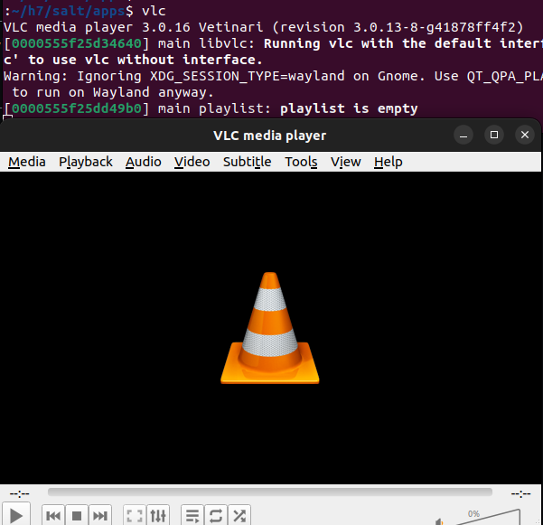
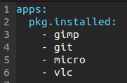
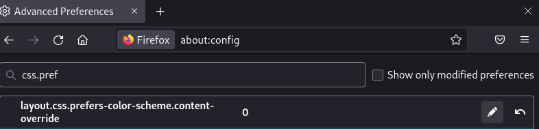
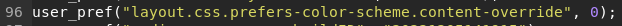
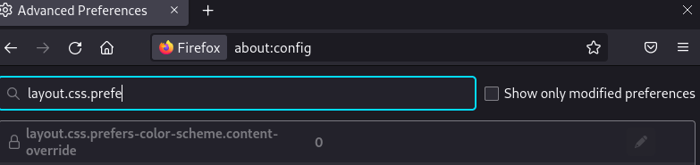
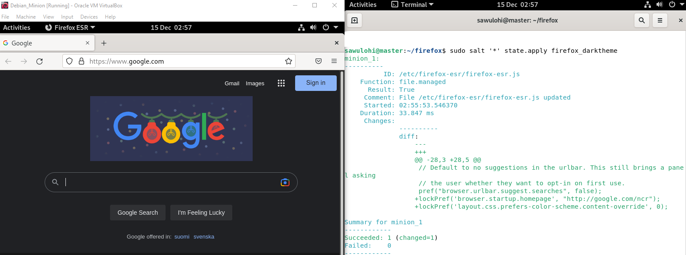

# Testing report for the project

This project will be using [Debian/Bullseye64](https://www.debian.org/download) and [Ubuntu22.04.1 LTS](https://releases.ubuntu.com/22.04.1/ubuntu-22.04.1-desktop-amd64.iso).
The host machines used for testing are ran on VirtualBox (Version 6.1.26 r145957 (Qt5.6.2)) using the aformentioned Linux distros.

### Have SaltStack installed on your desired host machines!

You can find directions for this here: [Tero Karvinen Salt Quickstart – Salt Stack Master and Slave on Ubuntu Linux](https://terokarvinen.com/2018/salt-quickstart-salt-stack-master-and-slave-on-ubuntu-linux/)
I'm using both Ubuntu 22.04.1 LTS and Debian 11 Bullseye. See README.md for download links!

### Make the init.sls file for packages using pkg.installed

I made the directory `~/salt` and `~/salt/apps` using mkdir. Then I proceeded to make the file `init.sls` in the /apps-directory:

```
$ cd h7/
$ mkdir salt
$ cd salt/
$ mkdir apps
$ cd apps/
$ micro init.sls

```

In the init.sls-file I made a small test for installing vlc:

```
~/h7$ cat salt/apps/init.sls 
vlc:
  pkg.installed

$ sudo cp -r ~/h7/salt/ /srv/salt/
$ sudo salt-call --local state.apply salt
local:
----------
          ID: vlc
    Function: pkg.installed
      Result: True
     Comment: The following packages were installed/updated: vlc
     Started: 07:24:32.078033
    Duration: 25266.501 ms
     Changes:   
#apparently installing vlc produces a 100+ lines of text, so I went ahead and cut them out
Summary for local
------------
Succeeded: 1 (changed=1)
Failed:    0
------------
Total states run:     1
Total run time:  25.267 s

```

Looked good, but just to be sure, I ran the command `vlc`. And lo and behold, VLC media player started:


I then went ahead and added other apps I wanted to install using `pkg.installed`:



### Finding configuration settings for dark theme for firefox!

For this part of the project, I found an article by Tero Karvinen, [Firefox System Wide Settings – /etc/firefox/syspref.js](https://terokarvinen.com/2016/firefox-system-wide-settings-etcfirefoxsyspref-js/)
I already knew that configuration changes can be made to files by writing over existing "default" config files by using `file.managed` in SaltStack.
The tricky part is knowing what to change and where. I did a bit of googling, and found [this small blog](https://hidde.blog/use-firefox-with-a-dark-theme-without-triggering-dark-themes-on-websites/) to find the change needed for the dark theme part of the config change. Changing the home page was already instructed on the previously mentioned article by Tero Karvinen.
I fiddled around with the `about:config`-page on Firefox to find the setting `layout.css.prefers-color-scheme.content-override`. As mentioned in the blog, changing the value to 1 set Firefox to light mode and 0 set it to dark mode:



Just to double check, I read up on [a previous project by Simo Tossavainen](https://simotossavainen.wordpress.com/2021/05/19/h7-oma-moduli/). In the article Tossavainen tells us, that his user-specific settings can be found under  ` ~/.mozilla/firefox/[YOUR_RESULTS_WILL_VARY].default-release/prefs.js`

```
$ micro ~/.mozilla/firefox/f2fcq80p.default-esr/prefs.js

user_pref("layout.css.prefers-color-scheme.content-override", 0);

```



My theory was that by changing the system wide settings, dark mode could be applied to every machine via SaltStack. The difference seemed to be that user preferences used `user_pref` and system wide changes used `lockPref`. I then tested this theory by making changes to the system wide settings of Firefox:
(NOTE: these system wide settings are like this only on Debian)
```
$ sudoedit /etc/firefox/syspref.js
lockPref('browser.startup.homepage', "http://google.com/ncr");
lockPref('layout.css.prefers-color-scheme.content-override', 0);
```
Saved and exited,
```
$ sudo cp /etc/firefox-esr/firefox-esr.js /srv/salt/firefox_darktheme/firefox-esr.js
```
I also checked Firefox:



The change seems to have worked, since this setting cannot be changed via this route any more (it's locked and cannot be edited). To omit the locking, you can leave out the 'lock' from 'lockPref'. I don't mind taking control away when it comes to dark mode, so the locking stayed.

```
$ sudo mkdir /srv/salt/firefox_darktheme/
$ cd /srv/salt/firefox_darktheme
$ micro init.sls
    
/etc/firefox-esr/firefox-esr.js:
  file.managed:
    - source: salt://firefox_darktheme/firefox-esr.js
```



Dark mode (and the new home page) was succesfully configured to the minion!

### Putting it all together

Now all there was left to do was to merge the two init.sls files (I also moved them under the same directory for simplicitys sake)

```
$ micro ~/h7/salt/firefox_darktheme/init.sls

apps:
      pkg.installed:
        - pkgs:
          - gimp
          - git
          - micro
          - vlc
          
/etc/firefox-esr/firefox-esr.js:
  file.managed:
    - source: salt://firefox_darktheme/firefox-esr.js
```

Run with ie. `sudo salt-call --local state.apply firefox_darktheme`

All done!

